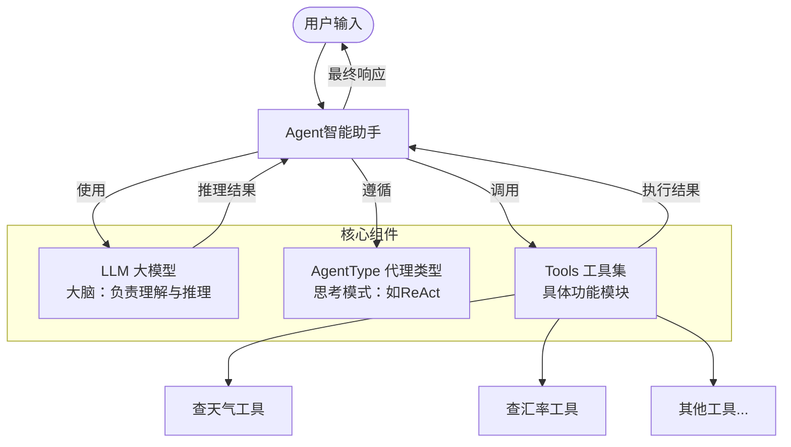
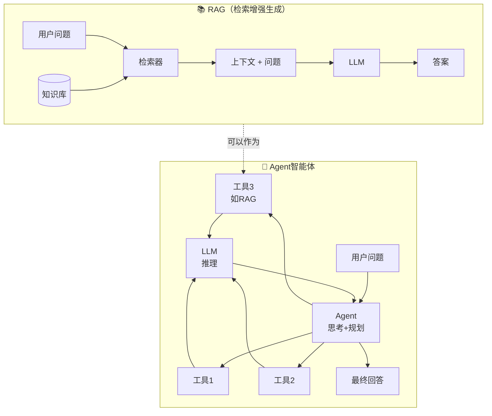
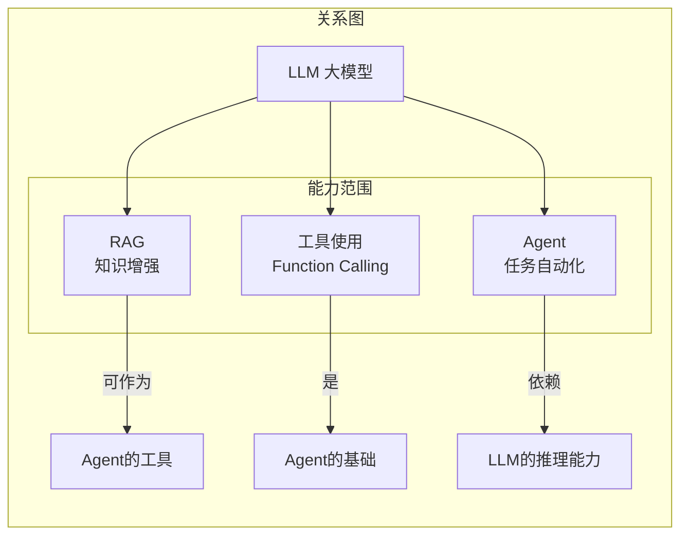

# 智能体（Agent）全面解析：什么是智能体agent

- Source: https://developer.aliyun.com/article/1714491
- Published: 2026-03-04 16:07:05

## 一、什么是智能体（Agent）？

智能体是一个能够**自主思考、决策、调用工具**的智能代理系统。它不仅仅是简单的问答机器人，而是具备以下核心能力的自主系统：

- 思考能力
- 决策能力
- 行动能力
- 记忆能力

#### 智能体的价值

智能体的出现，让AI从单纯的"对话者"进化为真正的"执行者"。它能够像人类助手一样，理解复杂指令、拆解任务、调用各种工具完成工作。

#### 智能体的核心优势

- 大脑
- 记忆
- 工具

---

## 二、两种搭建智能体的路径

根据技术门槛和应用场景，智能体的搭建主要有两种方式：

#### 1️⃣ 低代码/无代码路径（适合业务人员、快速验证）

**代表工具：Coze（扣子）**

| 特性 | 说明 |
| --- | --- |
| 定位 | "白宝箱"，即开即用 |
| 适用人群 | 业务人员、产品经理、运营人员 |
| 技术门槛 | 无需编程基础 |
| 开发速度 | 分钟级搭建 |
| 应用场景 | 自媒体文案批量生成、客服自动回复、简单任务自动化 |

**优点**：

- 可视化拖拽界面，操作简单
- 内置丰富工具和模板
- 快速验证业务想法
- 降低AI应用门槛

#### 2️⃣ 专业开发路径（适合开发者、深度定制）

**代表框架：LangChain**

| 特性 | 说明 |
| --- | --- |
| 定位 | 大模型应用开发框架 |
| 适用人群 | 开发者、技术团队 |
| 技术门槛 | 需要编程基础 |
| 开发速度 | 根据复杂度而定 |
| 应用场景 | 复杂业务流程自动化、企业级智能系统、深度定制需求 |

**优点**：

- 高度灵活，可深度定制
- 支持复杂逻辑和多步骤任务
- 可与现有系统深度集成
- 完全控制整个流程

---

## 三、智能体的核心组件

#### 📋 组件详细解读

| 组件 | 比喻 | 作用说明 | 代码中的角色 |
| --- | --- | --- | --- |
| Tool（工具） | 🛠️ 手脚 | 单个功能模块，比如查天气、查汇率、计算器。每个工具专注做一件事。 | 像是一个个插头，可以随时插拔 |
| LLM（大模型） | 🧠 大脑 | Agent的大脑，负责理解用户意图、进行推理决策。常用模型如 qwen-turbo、GPT。 | 核心处理器 |
| AgentType（代理类型） | 🧮 思考方式 | 决定Agent如何"思考"和"推理"，常见的有 ReAct（边推理边行动）、Plan-and-Execute（先规划后执行）。 | 思维模式模板 |
| initialize_agent | 🏭 装配车间 | 把大脑（LLM）和工具们组合起来，生成一个能跑的智能助手。 | 初始化函数/构造函数 |

**形象比喻**：`initialize_agent` 就像是一个装配车间，它把 LLM（大脑）和 Tool（手脚）按照 AgentType（思考方式）组装起来，最终造出一个完整的智能助手。

---

## 四、RAG vs Agent智能体

RAG（检索增强生成）和Agent是两种不同的技术路线，但可以相互配合。

#### 📊 核心区别对比

| 维度 | RAG | Agent 智能体 |
| --- | --- | --- |
| 本质 | 信息增强技术 | 任务规划与执行框架 |
| 主要目的 | 让LLM获取外部知识，减少幻觉 | 让LLM能够自主完成任务 |
| 工作方式 | 检索 + 生成 | 思考 → 规划 → 执行 → 观察循环 |
| 外部依赖 | 知识库/向量数据库 | 多种工具（API、计算器、RAG等） |
| 决策能力 | 无自主决策，直接使用检索内容 | 有自主决策，能规划步骤 |
| 复杂度 | 相对简单 | 复杂，需要多步推理 |
| 典型应用 | 客服问答、文档问答 | 自动订票、数据分析、多步骤任务 |

#### 🔄 两者关系

#### 💡 总结

- RAG读书
- Agent做事
- RAG可以作为Agent的一个工具
- 两者可以结合使用，打造更强大的智能系统

---

## 五、Agent vs 自动化工作流

| 维度 | 传统自动化工作流 | Agent智能体 |
| --- | --- | --- |
| 决策方式 | 固定的if-then-else规则 | 基于LLM的动态决策 |
| 灵活性 | 低，需要人工预设所有分支 | 高，能处理未知情况 |
| 维护成本 | 高，规则变化需人工修改 | 低，只需调整提示词 |
| 适用范围 | 确定性、重复性任务 | 复杂、多变、需要推理的任务 |
| 学习能力 | 无 | 有记忆，可积累经验 |

---

## 七、总结

智能体（Agent）是AI从"对话"走向"行动"的关键一步。通过赋予AI**思考能力**和**工具使用能力**，我们正在创造真正能帮人类干活、解决问题的智能助手。

无论是通过Coze拖拽生成的低代码方式，还是用LangChain代码构建的专业开发路径，最终目标都是一样的——打造一个能**自主思考、决策、调度工具**的智能代理。

随着LLM能力的不断提升和工具生态的日益丰富，智能体将在更多领域发挥重要作用，成为我们工作和生活中不可或缺的智能伙伴。
